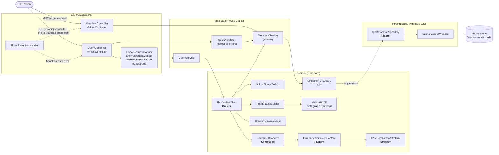

# vmetrix-query-manager

> **Proof of Concept** — Metadata-driven SQL query engine for VMetrix, a SaaS investment-management platform.

The engine receives a high-level query specification (columns + filters) via REST API and generates **parameterized SQL** automatically, resolving JOINs between tables based on **relationship metadata stored in the database**.

### Key Constraint

> Adding a new entity or field requires **zero Java code changes**.
> Everything is driven by metadata configuration.

---

## Table of Contents

- [Project Overview](#project-overview)
- [Prerequisites](#prerequisites)
- [How to Run](#how-to-run)
- [How to Run Tests](#how-to-run-tests)
- [Architecture](#architecture)
- [Data Model](#data-model)
- [How the Metadata Engine Works](#how-the-metadata-engine-works)
- [API Reference](#api-reference)
- [H2 Console](#h2-console)
- [Design Patterns](#design-patterns)
- [Design Decisions](#design-decisions)
- [AI Usage in Development](#ai-usage-in-development)
- [Status](#status)
- [License](#license)

---

## Project Overview

**What it is.** A self-contained Spring Boot service that translates a declarative query specification (logical columns + nested AND/OR filters + sorting) into executable, parameterized SQL against an Oracle-compatible schema.

**Problem it solves.** Investment-management platforms need to let business users query arbitrary combinations of entities (transactions, instruments, counterparties, issuers…) without an engineer shipping Java code for every new column, filter, or JOIN. The engine is fully metadata-driven: a row in `META_COLUMN` or `META_RELATIONSHIP` is enough to expose a new column or a new JOIN path to the API — no recompile, no redeploy.

**What makes it metadata-driven.**
- All physical table / column names are looked up at runtime via metadata repositories.
- JOIN paths between entities are computed by a **BFS graph traversal** over `META_RELATIONSHIP`.
- Comparators (`equals`, `between`, `in`, `isNull`, …) are selected via a **Strategy pattern** indexed by comparator name.
- Filter trees of arbitrary depth are walked with a **Composite pattern**.
- The domain layer has **zero Spring/JPA imports** — it can be unit-tested in isolation.

---

## Prerequisites

- **Java 17+** (tested with Oracle JDK 17 and 21; source/target compile level is 17)
- **Maven 3.8+**
- No other runtime dependencies — the database is embedded **H2 in Oracle compatibility mode**.

---

## How to Run

Single command (from the project root):

```bash
mvn spring-boot:run
```

The service listens on **port 8080** (configurable via `server.port` in `application.yml`).

Once running, these endpoints are available:

| Purpose        | URL                                                  |
|----------------|------------------------------------------------------|
| Swagger UI     | http://localhost:8080/swagger-ui.html                |
| OpenAPI spec   | http://localhost:8080/v3/api-docs                    |
| H2 console     | http://localhost:8080/h2-console                     |
| Health check   | hit any endpoint — the service starts in ~3 seconds  |

See [H2 Console](#h2-console) for database credentials and example queries.

---

## How to Run Tests

Single command:

```bash
mvn test
```

**Coverage:**

- **Unit tests** (JUnit 5 + Mockito) — pure domain logic with mocked ports.
  - `FilterTreeRendererTest` — nested AND/OR groups, all comparator types, empty filters.
  - `JoinResolverTest` — single entity (no join), two entities, three entities, counterparty-vs-issuer disambiguation.
  - `ComparatorStrategyFactoryTest` — all valid mappings, unknown comparator throws.
  - `ComparatorStrategyTest` — SQL fragments produced by each of the 12 strategies.
  - `QueryValidatorTest` — unknown entity, non-filterable field, type mismatch, full error list returned (never fails fast).
  - `SelectClauseBuilderTest`, `FromClauseBuilderTest`, `OrderByClauseBuilderTest`, `QueryAssemblerTest` — clause builders.
  - `MetadataServiceTest` — cache behaviour and lookups.
  - `GlobalExceptionHandlerTest` — mapping of custom exceptions to ErrorResponse DTOs.
- **Integration tests** (Spring Boot Test + MockMvc) — full HTTP layer verification.
  - `QueryBuildIntegrationTest` — happy path from HTTP request to SQL response.
  - `QueryValidationIntegrationTest` — invalid request returns HTTP 400 with the complete error list.
  - `MetadataControllerIntegrationTest` — `GET /api/metadata/entities` returns all three entities.
  - `MetadataServiceIntegrationTest` — loads metadata against the real H2 schema.
  - `OpenApiIntegrationTest` — basic `/v3/api-docs` accessibility.
  - `OpenApiContractTest` — deep verification of documentation picked up from interfaces and centralized examples.
  - `QueryManagerApplicationTest` — context loads.

### Architecture Tests

The project uses **ArchUnit** to enforce architectural integrity and prevent drift from the rules defined in `CLAUDE.md`.

- `ArchitectureTest` — Enforces 16 specific rules, including:
  - **Hexagonal Layering**: Ensures `api` → `application` → `domain` dependency flow; prevents leaks from `infrastructure` or `api` into the core.
  - **Strict Rule #4**: Zero `@Spring` dependencies in the `domain` layer.
  - **Strict Rule #5**: Zero `JPA` imports in the `domain` layer.
  - **Naming Conventions**: Enforces `*Controller`, `*Service`, `*Strategy`, and `*Builder` placement and naming.
  - **Cycle Detection**: Prevents circular dependencies between top-level packages.

Run a single class:

```bash
mvn test -Dtest=FilterTreeRendererTest
```

### Functional Verification

For manual testing of the API endpoints (including multi-hop joins and complex nested filters), refer to the detailed documentation:

- [**Verification Plan**](./docs/testing/VERIFICATION_PLAN.md) — Acceptance criteria and requirement checklist.
- [**API Test Suite**](./docs/testing/TEST_SUITE.md) — Ready-to-use JSON payloads for `curl` or Postman.

---

## Architecture

The project follows **Hexagonal Architecture (Ports & Adapters)** to keep the domain completely framework-agnostic.

### Package Tree

```
com.vmetrix.querymanager
├── api/                    ← Adapters IN (controllers, DTOs, mappers, documentation)
│   ├── controller/             HTTP layer — no business logic
│   ├── documentation/          OpenAPI documentation interfaces (decoupled)
│   ├── config/                 OpenAPI / Swagger configuration
│   ├── dto/request/            Incoming request shapes (+ @Schema)
│   ├── dto/response/           Outgoing response shapes (+ @Schema)
│   ├── exception/              GlobalExceptionHandler, ErrorResponse
│   └── mapper/                 DTO ↔ Domain mapping (MapStruct)
│
├── application/            ← Use cases & orchestration
│   ├── service/                QueryService, MetadataService, QueryValidator
│   ├── config/                 QueryEngineConfig (wires domain beans)
│   └── port/                   Application-level interfaces
│
├── domain/                 ← Core business logic — NO framework deps
│   ├── model/                  EntityMetadata, FieldMetadata,
│   │                           RelationshipMetadata, FilterNode,
│   │                           JoinNode, QueryResult, ValidationError
│   ├── port/                   MetadataRepository (interface only)
│   └── engine/                 SQL generation engine
│       ├── filter/                 FilterTreeRenderer,
│       │                           ComparatorStrategy + 12 impls,
│       │                           ComparatorStrategyFactory
│       ├── join/                   JoinResolver (BFS), JoinNode
│       └── builder/                SelectClauseBuilder, FromClauseBuilder,
│                                   OrderByClauseBuilder, QueryAssembler,
│                                   QuerySpecification
│
├── infrastructure/         ← Adapters OUT (JPA, DB access)
│   └── persistence/
│       ├── adapter/                JpaMetadataRepository (implements port)
│       ├── entity/                 JpaMetaTable, JpaMetaColumn, JpaMetaRelationship
│       └── repository/             Spring Data repos (internal only)
│
└── shared/                 ← Cross-cutting concerns
    └── exception/              Custom exceptions
```

### Layer Dependency Rules

```
api            → can import application, domain, shared
application    → can import domain, shared
domain         → can import shared ONLY  (no Spring, no JPA)
infrastructure → can import domain, shared
shared         → no imports from other layers
```

### Request Flow



---

## Data Model

### Business Tables

Three core business tables connected through foreign keys:

```
TRANSACTION ──── INSTRUMENT_ID ────→ INSTRUMENT
TRANSACTION ──── COUNTERPARTY_ID ──→ PARTY (as counterparty)
INSTRUMENT  ──── ISSUER_ID ────────→ PARTY (as issuer)
```

### Metadata Tables

The engine's runtime model definition — **no code changes needed to add new entities or fields**:

| Table               | Purpose                                                       |
|---------------------|---------------------------------------------------------------|
| `META_TABLE`        | Entity definitions (logical name → physical table)            |
| `META_COLUMN`       | Field definitions per entity (logical name → physical column) |
| `META_RELATIONSHIP` | JOIN relationship definitions between entities                |

Schema is initialized via `src/main/resources/schema.sql` + `data.sql` with `spring.sql.init.mode=always`.

---

## How the Metadata Engine Works

### 1. Logical → Physical Name Resolution

```
API request field: "txnDate"  (camelCase)
        ↓
MetadataService.findField("transaction", "txnDate")
        ↓
FieldMetadata { physicalName: "TXN_DATE", ... }
        ↓
SQL output:  t.TXN_DATE
```

### 2. Entity Alias Resolution

```
Request entity: "counterparty"  (relation alias, not a table name)
        ↓
MetadataService.findEntityByAlias("counterparty")
        ↓
EntityMetadata { physicalTable: "PARTY", alias: "cp" }
        ↓
SQL:  LEFT JOIN PARTY cp ON t.COUNTERPARTY_ID = cp.PARTY_ID
```

### 3. Automatic JOIN Resolution

```
Entities requested:  [transaction, instrument, counterparty]
        ↓
JoinResolver: BFS graph traversal over RelationshipMetadata
        ↓
Result: [ JoinNode(transaction → instrument),
          JoinNode(transaction → party/counterparty) ]
```

All table and column names come from metadata — **never hardcoded**.

---

## API Reference

Full interactive docs at http://localhost:8080/swagger-ui.html while the service is running.

| Method | Endpoint                      | Description                                         |
|--------|-------------------------------|-----------------------------------------------------|
| `POST` | `/api/query/build`            | Generate parameterized SQL from a query spec        |
| `POST` | `/api/query/execute`          | Generate + runtime SQL, returning actual data rows  |
| `POST` | `/api/query/validate`         | Validate a spec and return the full error list      |
| `GET`  | `/api/metadata/entities`      | List all entities with their fields + relations     |
| `GET`  | `/api/metadata/comparators`   | List valid comparators grouped by data type         |

### POST `/api/query/build`

**Request**

```json
{
  "select": [
    { "entity": "transaction", "field": "txnDate" },
    { "entity": "counterparty", "field": "partyName", "alias": "counterpartyName" }
  ],
  "filters": {
    "operator": "AND",
    "conditions": [
      { "entity": "transaction", "field": "status",
        "comparator": "equals", "value": "SETTLED" }
    ]
  },
  "sorting": [
    { "entity": "transaction", "field": "txnDate", "direction": "DESC" }
  ],
  "maxResults": 500
}
```

**Response — 200 OK**

```json
{
  "sql": "SELECT t.TXN_DATE, cp.PARTY_NAME AS counterpartyName FROM TRANSACTION t LEFT JOIN PARTY cp ON t.COUNTERPARTY_ID = cp.PARTY_ID WHERE t.STATUS = :p1 ORDER BY t.TXN_DATE DESC FETCH FIRST 500 ROWS ONLY",
  "parameters": { "p1": "SETTLED" },
  "resolvedTables": ["TRANSACTION", "PARTY"],
  "resolvedJoins": ["LEFT JOIN PARTY cp ON t.COUNTERPARTY_ID = cp.PARTY_ID"],
  "metadata": {
    "columnCount": 2,
    "filterCount": 1,
    "generatedAt": "2026-04-18T00:00:00Z"
  }
}
```

**Error — 400 Bad Request** (unknown entity / field / comparator, malformed request)

```json
{
  "timestamp": "2026-04-18T00:00:00Z",
  "status": 400,
  "error": "Bad Request",
  "message": "Entity unknown_entity does not exist in metadata"
}
```

### POST `/api/query/execute`

Builds the parameterized SQL from the specification and executes it against the H2 database. Returns a list of maps representing the result set columns.

**Request**
(Same shape as `/build`)

**Response — 200 OK**

```json
[
  {
    "txnId": 1001,
    "txnDate": "2026-04-18",
    "counterpartyName": "Global Bank corp"
  },
  {
    "txnId": 1002,
    "txnDate": "2026-04-19",
    "counterpartyName": "Alpha Investments"
  }
]
```

### POST `/api/query/validate`

Same request shape as `/build`. Returns HTTP 200 with `valid=true` when the spec is valid, or HTTP 400 with the complete error list when invalid (the validator **never fails fast**).

**Response — 400 Bad Request** (validation errors)

```json
{
  "valid": false,
  "errors": [
    {
      "entity": "transaction",
      "field": "status",
      "comparator": "greaterThan",
      "message": "Comparator 'greaterThan' is not valid for string fields"
    }
  ]
}
```

### GET `/api/metadata/entities`

**Response — 200 OK** (truncated)

```json
[
  {
    "entity": "transaction",
    "physicalTable": "TRANSACTION",
    "alias": "t",
    "fields": [
      { "name": "txnId", "physicalName": "TXN_ID", "type": "number",
        "primaryKey": true, "filterable": true, "selectable": true },
      { "name": "txnDate", "physicalName": "TXN_DATE", "type": "date",
        "primaryKey": false, "filterable": true, "selectable": true }
    ],
    "relations": [
      { "alias": "instrument", "targetEntity": "instrument",
        "joinType": "LEFT JOIN", "sourceField": "INSTRUMENT_ID", "targetField": "INSTRUMENT_ID" },
      { "alias": "counterparty", "targetEntity": "party",
        "joinType": "LEFT JOIN", "sourceField": "COUNTERPARTY_ID", "targetField": "PARTY_ID" }
    ]
  }
]
```

### GET `/api/metadata/comparators`

**Response — 200 OK**

```json
{
  "string":    ["equals","notEquals","like","in","notIn","isNull","isNotNull"],
  "number":    ["equals","notEquals","greaterThan","lessThan","greaterOrEqual","lessOrEqual","between","in","isNull","isNotNull"],
  "date":      ["equals","notEquals","greaterThan","lessThan","greaterOrEqual","lessOrEqual","between","isNull","isNotNull"],
  "timestamp": ["equals","notEquals","greaterThan","lessThan","greaterOrEqual","lessOrEqual","isNull","isNotNull"]
}
```

### Supported Comparators by Data Type

| Type        | Comparators                                                                                                    |
|-------------|----------------------------------------------------------------------------------------------------------------|
| `string`    | `equals`, `notEquals`, `like`, `in`, `notIn`, `isNull`, `isNotNull`                                            |
| `number`    | `equals`, `notEquals`, `greaterThan`, `lessThan`, `greaterOrEqual`, `lessOrEqual`, `between`, `in`, `isNull`, `isNotNull` |
| `date`      | `equals`, `notEquals`, `greaterThan`, `lessThan`, `greaterOrEqual`, `lessOrEqual`, `between`, `isNull`, `isNotNull` |
| `timestamp` | `equals`, `notEquals`, `greaterThan`, `lessThan`, `greaterOrEqual`, `lessOrEqual`, `isNull`, `isNotNull`       |

---

## H2 Console

The H2 web console is enabled for local development.

| Setting   | Value                                              |
|-----------|----------------------------------------------------|
| URL       | http://localhost:8080/h2-console                   |
| JDBC URL  | `jdbc:h2:mem:vmetrix;MODE=Oracle;DB_CLOSE_DELAY=-1`|
| User Name | `sa`                                               |
| Password  | *(empty — leave blank)*                            |
| Driver    | `org.h2.Driver`                                    |

### Example Verification Queries

Paste these into the H2 console to confirm seed data loaded correctly:

```sql
-- 1. List all tables (business + metadata)
SHOW TABLES;

-- 2. Count seeded transactions
SELECT COUNT(*) AS transaction_count FROM TRANSACTION;

-- 3. Show metadata columns for the 'transaction' entity
SELECT c.LOGICAL_NAME, c.PHYSICAL_NAME, c.DATA_TYPE
FROM META_COLUMN c
JOIN META_ENTITY e ON c.ENTITY_ID = e.ENTITY_ID
WHERE e.ENTITY_NAME = 'transaction'
ORDER BY c.COLUMN_ID;
```

### API Verification Examples

Use `curl` or Postman to verify the endpoints. For a more comprehensive suite of tests (multi-hop joins, nested logic), see [**API Test Suite**](./docs/testing/TEST_SUITE.md).

#### 1. Execute a Query (Happy Path)
```bash
curl -X POST http://localhost:8080/api/query/execute \
     -H "Content-Type: application/json" \
     -d '{
  "select": [
    { "entity": "transaction", "field": "txnId" },
    { "entity": "counterparty", "field": "partyName", "alias": "counterpartyName" }
  ],
  "filters": {
    "entity": "transaction", "field": "currency", "comparator": "equals", "value": "USD"
  },
  "maxResults": 10
}'
```

#### 2. Build SQL (Dry Run)
```bash
curl -X POST http://localhost:8080/api/query/build \
     -H "Content-Type: application/json" \
     -d '{
  "select": [{ "entity": "transaction", "field": "txnId" }],
  "filters": { "entity": "transaction", "field": "status", "comparator": "equals", "value": "SETTLED" }
}'
```

#### 3. Validate Query (Error Collection)
```bash
curl -X POST http://localhost:8080/api/query/validate \
     -H "Content-Type: application/json" \
     -d '{
  "select": [{ "entity": "transaction", "field": "invalid_field" }]
}'
```

---

## Design Patterns

### Composite — Filter Tree

Nested AND/OR filter groups of arbitrary depth.

- `FilterNode` — interface
- `FilterGroup` — composite node (operator + children)
- `FilterCondition` — leaf node (entity, field, comparator, value)

Location: `domain/engine/filter/` + `domain/model/`.

### Strategy — Comparator Mapping

Each comparator produces different SQL. One implementation per comparator resolved at runtime via `ComparatorStrategyFactory`.

| Strategy               | SQL Fragment                      |
|------------------------|-----------------------------------|
| `EqualStrategy`        | `column = :p1`                    |
| `NotEqualStrategy`     | `column <> :p1`                   |
| `GreaterThanStrategy`  | `column > :p1`                    |
| `LessThanStrategy`     | `column < :p1`                    |
| `GreaterOrEqualStrategy` | `column >= :p1`                 |
| `LessOrEqualStrategy`  | `column <= :p1`                   |
| `BetweenStrategy`      | `column BETWEEN :p1 AND :p2`      |
| `InStrategy`           | `column IN (:p1, :p2, ...)`       |
| `NotInStrategy`        | `column NOT IN (:p1, :p2, ...)`   |
| `LikeStrategy`         | `column LIKE :p1`                 |
| `IsNullStrategy`       | `column IS NULL`                  |
| `IsNotNullStrategy`    | `column IS NOT NULL`              |

### Builder — SQL Clause Construction

Each SQL clause built independently, then orchestrated by `QueryAssembler`:

- `SelectClauseBuilder` — SELECT projection
- `FromClauseBuilder`   — FROM + JOINs
- `OrderByClauseBuilder` — ORDER BY
- `QueryAssembler`       — final SQL assembly + parameter map

### Repository (Port/Adapter)

`MetadataRepository` interface in `domain/port/`, implemented by `JpaMetadataRepository` in `infrastructure/persistence/adapter/`.

### Factory — Strategy Resolution

`ComparatorStrategyFactory` holds a `Map<String, ComparatorStrategy>` and resolves the right strategy by name at runtime.

---

## Design Decisions

Each decision below explains **why** it was made, the **tradeoffs** accepted, and the **alternatives that were considered and rejected**.

### 1. Why Hexagonal Architecture

**Why.** The domain — filter tree, strategy selection, JOIN resolution, SQL assembly — is pure, deterministic logic. Hexagonal keeps it that way. Tests for the domain run in milliseconds without a Spring context.

**Tradeoffs.** More files up front (ports + adapters + models). More layers to walk when following a request. Mapping between DTOs ↔ domain ↔ JPA adds noise.

**Alternatives rejected.**
- **Traditional layered (controller / service / repository)**: would pull Spring and JPA annotations into the core. One @Autowired in the wrong place and the engine becomes untestable without a full context.
- **Plain-old three-tier over anaemic domain**: would scatter query-generation logic across services, preventing the deterministic test setup we rely on.

### 2. Why Metadata Lives in DB Tables (Not YAML/JSON)

**Why.** Runtime dynamism without redeploys. Adding a field is an `INSERT INTO META_COLUMN`; production can introspect metadata with the same SQL tools used for any other data.

**Tradeoffs.** Bootstrapping is more work (needs seed scripts). Metadata caching discipline is non-optional or every query triggers repository calls. Schema changes to metadata tables themselves still require a migration.

**Alternatives rejected.**
- **YAML/JSON file shipped with the jar**: ties metadata changes to deployments; no SQL query-ability; file parsing at startup adds error modes.
- **Annotated Java classes**: defeats the key constraint — would require Java code changes per new field.

### 3. Why Composite for the Filter Tree

**Why.** Filter payloads support arbitrarily nested AND/OR groups. Composite models groups and leaves uniformly under a single `FilterNode` interface; the renderer walks the tree with a single recursive visit.

**Tradeoffs.** Slightly less type safety at the interface level — callers have to check `instanceof` (mitigated by Java 17 pattern matching).

**Alternatives rejected.**
- **Flat list with explicit parent/child IDs**: harder to serialize from JSON, harder to validate, harder to render.
- **Visitor pattern with double dispatch**: overkill for two node types; the recursive renderer is simpler.

### 4. Why Strategy for Comparators

**Why.** Twelve comparators × four data types = a lot of branches. Strategy turns each comparator into a small, individually testable class. The Open/Closed principle is preserved — adding a new comparator means adding a new class and wiring it into the factory, with zero edits to existing strategies.

**Tradeoffs.** Twelve files instead of one. A small perf cost from a map lookup (irrelevant vs. actual SQL execution).

**Alternatives rejected.**
- **Single `switch` statement / if-else chain**: every new comparator edits the hotspot; mixes concerns; harder to unit-test per comparator.
- **Enum with abstract methods**: would require the enum to know about parameter-binding mechanics, coupling data and behaviour at a granularity we don't want.

### 5. Why BFS for JOIN Resolution

**Why.** BFS guarantees the **shortest** JOIN path between any two entities, yielding deterministic and minimal SQL regardless of input order. It also gives a predictable output for the same input — crucial for test assertions.

**Tradeoffs.** BFS holds the visited frontier in memory; for a metadata graph with thousands of entities this would matter, but for the VMetrix model (tens of entities) it's nothing.

**Alternatives rejected.**
- **DFS**: can take a longer JOIN path depending on iteration order; non-deterministic across JVMs.
- **Pre-computed JOIN paths in the metadata**: would duplicate info already in `META_RELATIONSHIP` and require manual sync when relationships change.

### 6. Why Builder for SQL Clauses

**Why.** SELECT, FROM+JOIN, WHERE, ORDER BY each have their own assembly rules, parameter counters, and edge cases. Separating them into one Builder per clause keeps each one small and independently testable. `QueryAssembler` orchestrates them.

**Tradeoffs.** More classes than a monolithic `SqlGenerator`. Each builder has to agree on a shared parameter-counter convention (centralized in `QueryAssembler`).

**Alternatives rejected.**
- **Single monolithic builder**: grows unbounded, hard to unit-test each clause in isolation.
- **SQL-template / StringBuilder directly inside the service**: defeats the whole point of hexagonal; also makes parameter binding error-prone.

### 7. Why MapStruct over Manual Mappers

**Why.** DTO ↔ domain mapping is pure boilerplate. MapStruct generates the mapper at compile time — zero runtime reflection, compile-time guarantees that mappings are complete, and readable generated code you can inspect in `target/`.

**Tradeoffs.** Adds an annotation processor to the build. For complex nested mappings (like the polymorphic `FilterNodeDto`) you still write `default` helper methods — the generated code only handles the straight-through cases.

**Alternatives rejected.**
- **Manual mappers**: verbose, easy to miss a field, untested unless you write mapper tests.
- **ModelMapper / reflection-based libraries**: runtime cost; fails silently when fields drift.

### 8. Tradeoff — H2 Oracle Mode vs. Real Oracle

**Why H2 in Oracle compatibility mode (`MODE=Oracle`).** Zero-install demo; tests run without Testcontainers or a real Oracle license. DDL uses Oracle types (`NUMBER`, `VARCHAR2`, `TIMESTAMP`) and Oracle-compatible syntax like `FETCH FIRST N ROWS ONLY`, so the SQL the engine emits is valid Oracle SQL.

**Known gaps (tradeoffs).**
- H2's Oracle mode covers syntax, not every Oracle-specific function or hint.
- Performance characteristics (execution plans, optimizer behaviour) are **not** representative of Oracle.
- A production deployment would swap the JDBC URL / Hibernate dialect and re-run the integration test suite against a real Oracle instance.

**Alternatives rejected.**
- **Pure PostgreSQL / H2 default mode**: syntactic gotchas (`LIMIT` vs `FETCH FIRST`, different quote handling) would leak into the engine.
- **Testcontainers with Oracle XE**: heavy for a PoC; adds minutes per test run; requires a running Docker daemon.

### 9. Why Comparator Validity Lives in Java (Not in a Metadata Table)

**Why.** Comparator validity per data type (e.g., `between` doesn't make sense on `string`) is a **semantic contract of the engine**, not configuration. Storing it in a `META_COMPARATOR_TYPE` table invites configurators to break the engine by removing legitimate comparators or adding impossible ones. Keeping it in `ComparatorStrategyFactory` + `QueryValidator` makes it code-reviewed, compiler-checked, and versioned with the engine.

**Tradeoffs.** A new comparator requires a code change (but so does implementing its `ComparatorStrategy`, so the code change is unavoidable anyway).

**Alternatives rejected.**
- **Metadata-table-driven comparator validity**: adds a rarely-changing config surface whose only effect is to *restrict* the engine; configuration errors would produce confusing "valid by metadata, invalid by strategy" states.

---

## AI Usage in Development

This section summarizes how AI assistance was used during the build of this PoC.

### Tool(s) Used

- **Claude (Anthropic)** via an OpenCode CLI agent, steered by the repo-level contract in [`CLAUDE.md`](./CLAUDE.md) and the reusable skills in [`.ai/skills/`](./.ai/skills/).
  - `commit-message-generator` skill — enforces Conventional Commits with Jira key references.
  - `jira-workflow` skill — drives acceptance-criteria checklists, TDD, and per-subtask commits.

### Tasks Where AI Helped

- **Design discussion** — challenging the hexagonal boundaries, the Strategy-vs-switch comparator choice, the BFS-vs-DFS JOIN decision. AI surfaced tradeoffs which were then validated against the `CLAUDE.md` decision log.
- **Code scaffolding** — DTO shapes, MapStruct interfaces, strategy class skeletons, OpenAPI annotations, configuration beans.
- **Test generation** — producing initial RED tests for new comparators and for the OpenAPI availability contract. AI was encouraged to cover edge cases that a human author tends to skip (empty filters, unknown entity, comparator-type mismatch).
- **Documentation** — expanding the README with the Mermaid request-flow diagram, the design-decision narratives (why/tradeoffs/alternatives), and the API reference examples.
- **Refactoring with guardrails** — AI was gated by the strict rules in `CLAUDE.md` (no hardcoded names, no SQL concatenation, no Spring annotations in `domain/`). When a proposed change would have violated a rule — for example, adding `@Schema` to `ValidationError` — the agent flagged it and introduced an API-layer `ValidationErrorDto` mirror instead.

### Cases Where AI Output Was Corrected, Discarded, or Redone

- Initial AI draft of `JoinResolver` used DFS; discarded in favour of BFS for deterministic, shortest-path JOINs (now captured in Design Decision §5).
- AI proposed caching metadata in a static field; redone as a Spring-managed `MetadataService` cache to keep the lifecycle explicit and testable.
- AI's first pass at the OpenAPI annotations suggested placing `@Schema` on `ValidationError` (a domain class). This would have violated `CLAUDE.md` Strict Rule §4 ("no Spring annotations in domain"). The approach was redone with a new `ValidationErrorDto` in the `api/` layer plus a MapStruct `ValidationErrorMapper` to translate domain → API, keeping the domain framework-free.
- AI occasionally suggested adding dependencies to `pom.xml` on its own initiative (e.g., `spring-boot-starter-jdbc` for the bonus `/execute` endpoint). Per `CLAUDE.md` AI Interaction Rule §7, every new dependency was paused for explicit approval before being added.

### Learnings About Effective AI Usage

- **Pin the contract first.** `CLAUDE.md` being read at the start of every session is what prevents architectural drift. Without it the agent regresses toward the most common Spring patterns, not the hexagonal ones this PoC requires.
- **Skills beat one-off prompts.** The `jira-workflow` and `commit-message-generator` skills encode repeatable process steps — acceptance-criteria checklists, TDD order, commit scope, Jira comment content — so each ticket executes the same way and reviews stay consistent.
- **TDD discipline is non-negotiable.** Asking AI for the test first (RED) before asking for the implementation (GREEN) catches ambiguous requirements earlier than any human review would.
- **Constrain the tool diff.** The agent was explicitly told "do not commit unrelated dirty files", "do not change architecture decisions without a design-decision entry", and "ask before adding a dependency". These negative instructions matter more than the positive ones.
- The largest productivity gain was on **documentation and examples** (this README, the OpenAPI `@ExampleObject` payloads) — areas where AI is factually grounded by the existing code and the cost of a human author is high. The **smallest gain was on validator messages** — too project-specific to be worth more than a starting sentence.

---

## Status

🟡 **Proof of Concept** — This project validates the metadata-driven query engine approach. Not intended for production use without further hardening (real Oracle testing, proper connection pooling profiles, security/authentication, rate limiting, observability).

---

## License
